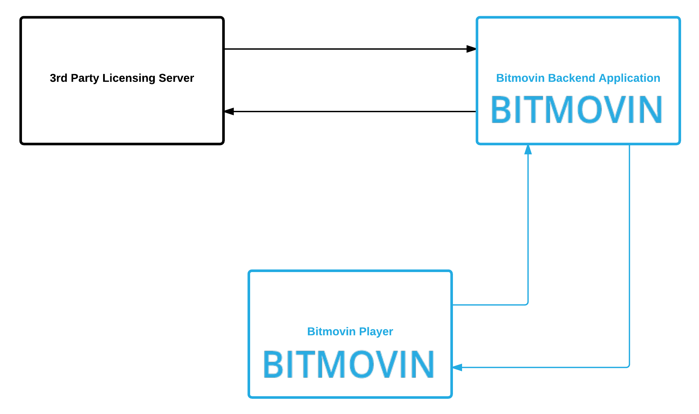

# 3rd Party Bitmovin Player Licensing



### This is a simple implementation of a 3rd party licensing server which demonstrates the usage in combination with the Bitmovin Adaptive Streaming Player and our backend application.

If a player instance has third-party-license-checking enabled, all license calls are passed to a specified 3rd party license server.
To enable third-party-license-checking, two things need to be specified:
- An API path which implements a certain behavior as described below.
- A failure action which defines what to do if an error or timeout occurs when calling this API path.

The 3rd party license server is called by an HTTP/POST request with the following payload:
```json
{
   "domain"    :"dummydomain.com",
   "key"       : "your_player_licensekey",
   "version"   : "player_version",
   "customData": {
     "thirdPartyKey" :"key1",
     "param2"        :"data2"
   }
}
```

The content of the 'customData' field can be of arbitrary and is specified in the player configuration. Its structure is designed as an array of key/value pairs of type `Object` which is passed through to the 3rd party licensing server.

Response-codes:
The license of a player instance is allowed or denied based on the following HTTP response codes of the 3rd party licensing server:

HTTP code 2xx -> allow license<br>
HTTP code 4xx -> deny license<br>
HTTP code 5xx -> allow or deny based on configured failure action<br>


To make sure the player gets a license decision in any case, a failure action has to be configured. The failure action specifies whether Bitmovin's licensing backend should either ALLOW or DENY a license in case the 3rd party licensing server returns a 5xx HTTP error code or the request times out. The 3rd party licensing server is called with a default timeout of 1000ms.

The HTTP response of the 3rd party licensing server can have a "customData" field just as the HTTP call which is passed through to the player.
   
### More information about the 3rd party licensing and the player configuration and API in general, can be found in our [online documentation](https://developer.bitmovin.com/playback).
